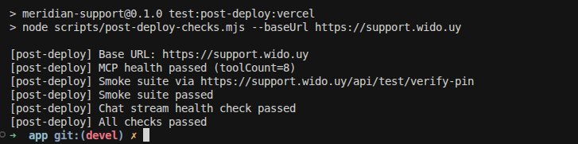
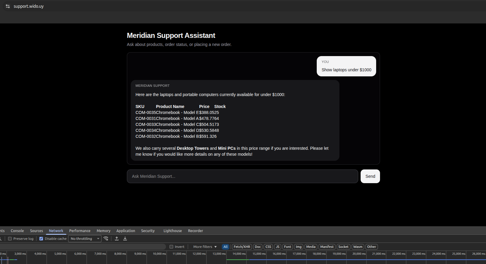
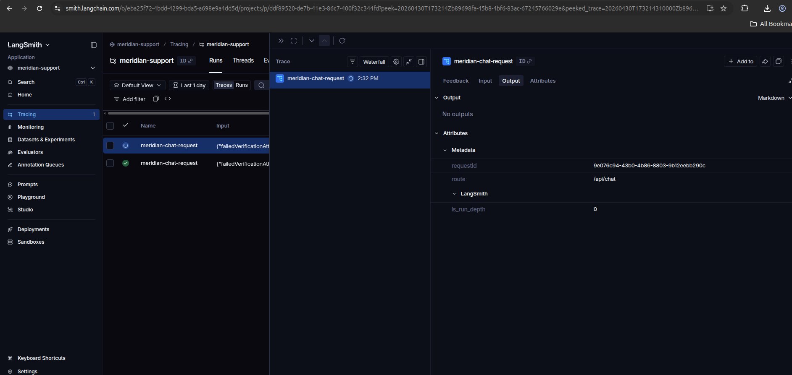

# Meridian Electronics MCP Chatbot

Production-ready support chatbot for Meridian Electronics, built with Next.js + AI SDK and powered by `order-mcp`.

## Problem

Customer support teams need fast, consistent answers for product discovery, identity verification, and order operations without exposing sensitive customer data.

## Solution

This project delivers a secure chat assistant that discovers MCP tools dynamically, enforces verification-first access for sensitive actions, and streams clear responses to end users with Markdown/table-friendly rendering.

## MCP tools used

The assistant connects to `order-mcp` and uses these core tools:

- `list_products`, `get_product`, `search_products`
- `verify_customer_pin`
- `get_customer`, `list_orders`, `get_order`, `create_order`

Supporting API routes:

- `GET /api/mcp` for MCP health/tool introspection
- `POST /api/chat` for streaming chat orchestration
- `POST /api/test/verify-pin` for deterministic verification tests

## Backend Framework

The backend is implemented with Next.js App Router Route Handlers in `app/src/app/api`, using Vercel AI SDK (`streamText`) and `@modelcontextprotocol/sdk` for tool execution.  
Default model path is OpenRouter (`google/gemini-3-flash-preview`) with Google provider fallback.

## Frontend

The frontend is a Next.js + React chat UI with modular components (`ChatContainer`, `MessageBubble`, `OrderCard`) and streaming interaction support, including Markdown + GFM table rendering.

## Deploy locally

Use this flow to run the app on your machine.

```bash
cd app
npm install
npm run dev
```

Open [http://localhost:3000](http://localhost:3000).

## Test locally

Run deterministic checks locally to validate MCP connectivity and PIN verification paths.

```bash
cd app
npm run test:smoke:local
npm run test:post-deploy:local
```

To manually validate Markdown tables in chat, ask for product lists (e.g. "List available computers") and verify formatted table output.

## Deploy to Vercel

Deploy as a monorepo subdirectory project so Vercel builds only the Next.js app.

1. Import this repository in Vercel.
2. Set **Root Directory** to `app`.
3. Configure environment variables in Vercel.
4. Deploy and verify `/`, `/api/mcp`, and `/api/chat`.

## Test Vercel deployment

Use the public domain checks after each deployment.

```bash
cd app
npm run test:smoke:vercel
npm run test:post-deploy:vercel
```

`test:post-deploy:vercel` is pinned to `https://support.wido.uy` and includes:

- MCP health check (`/api/mcp`)
- deterministic verify-pin smoke subset
- real chat stream check (`/api/chat`)

## Structured logging

Structured JSON logs are emitted with request IDs and lifecycle events for chat requests and tool calls, enabling easy filtering in Vercel logs or external log pipelines.

## Guardrails used

Security and behavior guardrails are codified in `AGENTS.md` and implemented in the app:

- verification required before sensitive order/customer tools
- privacy-safe responses (no full address/payment exposure)
- bounded retry flow for invalid verification attempts
- graceful timeout/error messaging for MCP failures

## Observability with LangSmith

LangSmith tracing is supported via environment variables and records request-level chain runs, tool activity summaries, and completion metadata.

Recommended variables in `app/.env.local` (and Vercel):

```bash
MCP_SERVER_URL=https://order-mcp-74afyau24q-uc.a.run.app/mcp
OPENROUTER_API_KEY=your_openrouter_key
LANGSMITH_TRACING=true
LANGSMITH_API_KEY=your_langsmith_api_key
LANGSMITH_PROJECT=meridian-support
```

Fallback provider keys are also supported:

```bash
GOOGLE_GENERATIVE_AI_API_KEY=your_google_key
GOOGLE_API_KEY=your_google_key
```

## Screenshots

### Smoke test evidence



### Vercel production UI



### LangSmith observability


